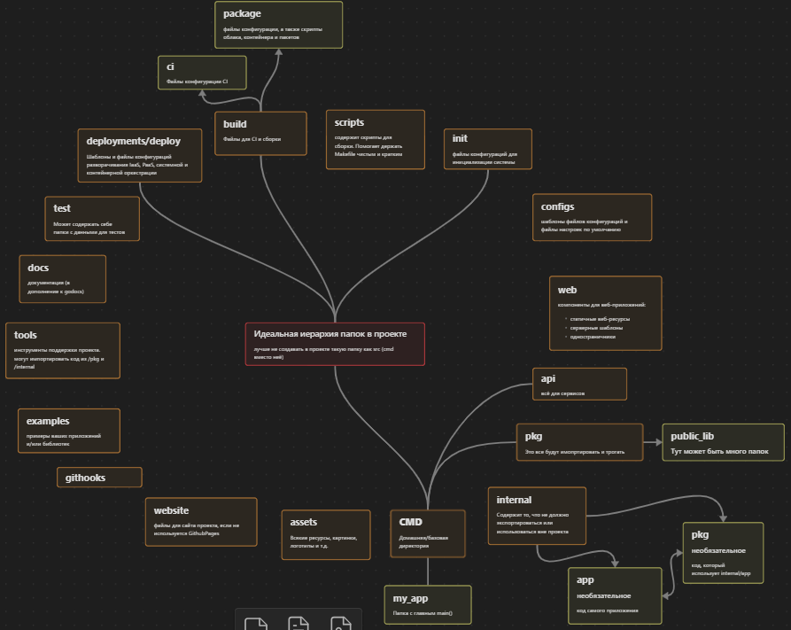
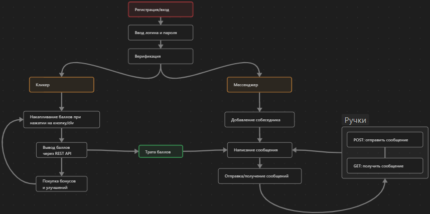

# История создания
В данном файле в хронологическом порядке будет описано что было сделано для реализации проекта. 
Эта информация идёт в дополнении к сообщениям в коммитам и просто показывает какие этапы были
у проекта.

## 02.09 Немного подготовки
Для упрощения понимания как расположить папки и что они значат была создана вот такая схема в Obsidian.

Затем была набросана подобная схема проекта, чтобы понять какие части нужно реализовать в первую очередь.

(придерживаться её я, конечно же, не буду)